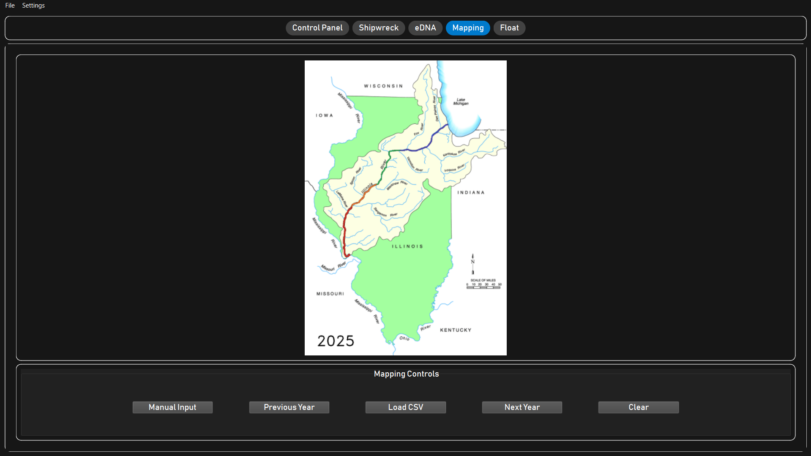

# ENG REN – MATE 2025 Ocean ROV Exploration GUI

This repository contains the **graphical control system** developed for the **MATE 2025 Ocean ROV Exploration Competition**.  
The application achieved **maximum points** in mission task execution, integrating real-time video streaming, sensor monitoring, and control tools into a single operator interface.

Built with **PySide6** and supported by **Flask** for web-based camera feeds, this GUI provides ROV pilots and mission specialists with the tools necessary for precise navigation, efficient task completion, and live data logging.

## Features
- **Mission Control GUI** built with PySide6 for streamlined ROV operations
- **Real-Time Video Streaming** from multiple cameras
- **Live Sensor Readouts** via serial communication
- **Database Logging** for mission data and events
- **Custom Graphics and UI Design** for clear underwater task execution
- **Modular Codebase** for future expansion and adaptation to other ROVs
- **Flask Integration** for web-based video and data access

## Project Structure
```
ENG REN/
├── Flask/               # Flask-based web server and camera streaming
├── libraries/           # Core control logic, sensor handling, and utilities
├── graphics/            # Logos, icons, and UI images
├── ui/                  # PySide6 UI design files (.ui)
├── database/            # SQLite database files for mission logs
├── Test scripts/        # Development and testing scripts
├── prototype.py         # GUI entry point
├── requirements.txt     # Python dependencies
└── NOTE.md              # Additional developer notes
```

## Installation

1. Clone the repository:
```bash
git clone https://github.com/<your-username>/ENG-REN.git
cd ENG-REN
```

2. Create and activate a virtual environment:
```bash
python -m venv venv
source venv/bin/activate       # Mac/Linux
venv\Scripts\activate          # Windows
```

3. Install dependencies:
```bash
pip install -r requirements.txt
```

## Usage

### Launch the GUI
```bash
python prototype.py
```

### Start Flask Camera Streaming (optional)
```bash
cd Flask
flask run
```
Access in your browser at: `http://127.0.0.1:5000`

## Requirements
- Python 3.8+
- PySide6
- Flask
- OpenCV (cv2)
- Other dependencies listed in `requirements.txt`

## GUI Preview (Gallery)

<p align="center">
  
  
  
</p>

<p align="center">
  <em>Main Control • Shipwreck Analysis • Fish DNA Samples</em>
</p>

### Optional: Additional Screens
<p align="center">
  
  
</p>

## Competition Achievement
This system was successfully deployed during the **MATE 2025 Ocean ROV Exploration Competition**, scoring the **maximum points possible** in mission tasks due to its:
- Reliability under competition conditions
- Efficient operator workflow
- Clear, responsive interface

## License
All rights reserved.  
Unauthorized copying, modification, or distribution of this software, via any medium, is strictly prohibited without explicit permission from the author.
